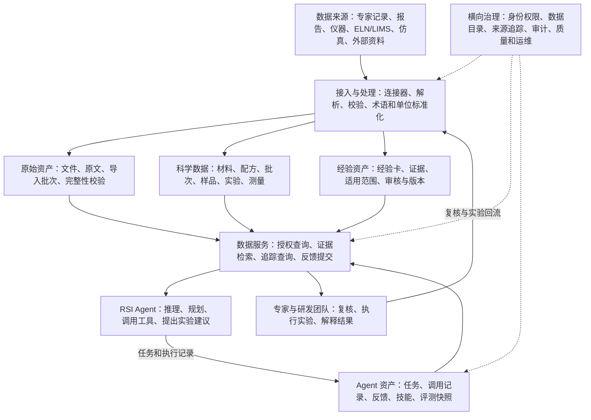
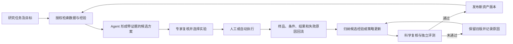

# RSI 自进化 Agent 数据平台：调研与现状对比底稿

版本：v0.1，2026-10-03。适用场景：宁德时代香港研究院 AI 新材料研发，先服务内部团队，后续考虑公司级复用。

## 1. 已知背景与研究边界

已知：平台需要沉淀国内及公司化学专家经验，支持 AI for Science，加快新材料研发。用户负责 RSI Agent 中的数据平台。试点材料体系、现有系统、部署约束、预算和研发指标尚未提供。

本文为公开资料定向调研与概念设计，不是公司现状审计，也不是完整产品选型。资料以论文、研究机构说明和官方技术文档为主。未验证各开源项目在公司环境中的适配性、运维成本或商业支持。RSI 暂沿用项目名称，其正式含义和进化范围待确认。

核心设计判断：平台需要把科学数据、带适用条件的专家经验、Agent 执行记录和真实研发反馈关联起来。第一阶段应选择一个研发任务验证闭环，并保留后续组织扩展所需的身份、权限和数据版本基础。

## 2. 公开案例与可借鉴能力

| 案例 | 公开资料支持的能力 | 对本平台的启示（设计推导） | 使用边界 |
|---|---|---|---|
| Reflexion | 用任务反馈生成反思文本并存入情景记忆，后续尝试使用这些记忆，无需更新模型权重。[S1] | 将任务、结果、反馈和经验版本关联，支持经验检索 | 通用任务研究，不能据此推断材料研发收益 |
| EvoDS | 学习可复用的可执行技能，并验证技能，结合自适应上下文管理。[S2] | 数据平台需要登记技能及其来源、验证记录、适用范围 | 论文页面标注 KDD2026 接收，基准收益不能直接迁移到企业研发 |
| EvoMaster | 2026 年 9 月修订版提出执行、探索、进化的嵌套循环，强调跨实验、跨研究保存外部证据。[S3] | 关联任务、实验和研究项目，避免每轮研发重新开始 | 当前查看的是 arXiv v5，研究框架不等于企业平台产品 |
| NOMAD | 材料科学数据管理平台，支持自定义 Schema 和 ELN，文档说明可对接外部 ELN。[S4] | 借鉴材料、样品、过程和测量的结构化建模，评估对接已有系统 | 需要核查内部仪器格式和业务模型，不能直接假设开箱即用 |
| AiiDA | 科学计算工作流自动化和数据来源追踪。[S5] | 仿真结果关联输入、计算过程与环境，保证结果可复现 | 重点在计算工作流，不覆盖全部实验与专家知识业务 |
| AIMD-L / CAIMEE | 通过事件数据层连接仪器、样品历史与应用，使用持久标识和元数据图谱。[S6] | 用统一标识关联样品生命周期，条件具备后接入事件流 | 机构说明展示架构，实际适配程度仍需验证 |
| NIST 自主实验生态研究 | 将样品管理、仪器通信、数据知识管理、算法模型集成列为标准化方向。[S7] | 明确各层接口，数据平台与仪器控制分别承担职责 | 该页面不意味着已有一个完整统一的行业标准 |
| NIST Autonomous Methods | 自主实验方法支持专家交互，专家可以观察分析并注入知识。[S8] | 将专家复核和修正作为工作流中的正式数据事件 | 不据其案例推算本项目的提速倍数 |
| MLflow | 从运行记录构建评测数据集，并对执行过程和输出进行评估。[S9] | 登记 Agent 版本，建立评测集、执行记录与反馈关联 | 通用评测能力需要增加材料领域的科学指标 |
| OPTIMADE | 提供材料数据库共同 API 规范，促进数据库互操作。[S10] | 外部数据库接入优先使用标准适配接口 | 不应将其视为内部实验、工艺和专家经验的完整数据模型 |

这些案例覆盖不同层面。公开资料没有证明存在一个能够直接满足宁德时代全部需求的统一平台。建议评估“复用已有公司系统，加上科学语义和经验进化服务”的组合方案。

## 3. 自进化的对象与平台职责

以下是用于需求讨论的分类，不是对当前 RSI 实现的判断。

| 进化对象 | 更新内容 | 数据平台承担的职责 | 建议阶段 |
|---|---|---|---|
| 知识与记忆 | 新结论、案例、失败经验、专家纠正 | 证据关联、审核状态、检索、版本、失效处理 | 试点优先 |
| 技能与工作流 | 数据处理工具、分析步骤、任务模板 | 技能登记、输入输出契约、执行记录、验证与回滚 | 在有稳定任务后引入 |
| 实验策略 | 候选排序、采样方法、参数搜索策略 | 实验反馈数据集、目标函数版本、不确定性和对照记录 | 有可靠实验回流后引入 |
| 模型参数 | 微调、强化学习、科学预测模型更新 | 训练数据快照、标签质量、数据划分、评测与模型版本 | 按需求单独论证 |

Agent 的文本反思属于候选经验。科学事实、专家判断、模型推测应分别标识。平台通过新的实验结果和专家复核更新证据状态，不能仅用 Agent 自评分证明研发效果提升。该要求是本项目的设计建议，依据是科学可追踪和可验证的目标。

## 4. 功能清单与逐项对比矩阵

优先级为暂定建议：P0 = 试点闭环基础，P1 = 试点任务确有需求时实现，P2 = 公司级或更高自动化阶段。全部公司现状均待确认，“未知”不计作缺口。

| 编号 | 功能与具体内容 | 暂定优先级 | 参考依据 | 公司现状 | 应补充的信息 |
|---|---|---|---|---|---|
| F01 | 接入 Excel、文档、仪器数据、ELN/LIMS、仿真结果，记录导入批次与失败原因 | P0 | S4、S6 | 待确认 | 最先接入的两类数据源、接口和责任人 |
| F02 | 保留原始文件与版本，校验文件完整性，支持重处理 | P0 | 来源追踪目标，设计推导 | 待确认 | 数据量、保留期、已有存储 |
| F03 | 统一材料、配方、批次、样品、实验和测量标识 | P0 | S4、S6、S7 | 待确认 | 现有编码与跨系统关联方式 |
| F04 | 标准化单位、测试条件、方法，检查缺失、重复、异常和冲突 | P0 | S4、S7，设计推导 | 待确认 | 质量规则和判定负责人 |
| F05 | 来源追踪与复现：输入、处理程序、参数、输出、执行环境 | P0 | S5、S6 | 待确认 | 目前能否复现报告中的结论 |
| F06 | 专家经验采集：访谈、报告抽取、工作中纠正，形成结构化经验卡 | P0 | S8，设计推导 | 待确认 | 专家数量、参与方式、复核机制 |
| F07 | 经验审批、分歧管理、适用范围、证据等级、版本与失效 | P0 | S1、S8，设计推导 | 待确认 | 谁审核，如何处理不同专家意见 |
| F08 | 关键词和语义检索，按材料、条件和项目过滤，返回原文证据 | P0 | 经验复用需求，设计推导 | 待确认 | 最常见问题和允许检索的数据范围 |
| F09 | 领域本体与知识关系，表达材料、工艺、结构、性能之间的关联 | P1 | S4、S6 | 待确认 | 是否需要跨实体推理，已有术语体系 |
| F10 | Agent 数据接口：查询、检索、获取样品记录、提交候选经验 | P0 | S3、S7，设计推导 | 待确认 | Agent 框架、接口协议、责任边界 |
| F11 | 执行记录与反馈：工具调用、证据、版本、结果、纠正、耗时和成本 | P0 | S1、S9 | 待确认 | 当前记录方式和反馈入口 |
| F12 | 评测集和数据集版本：冻结快照，隔离评测数据，关联评测结果 | P0 | S9，设计推导 | 待确认 | 真实任务案例、评测方法与基线 |
| F13 | 技能登记、验证、发布与回滚，区分候选和可用版本 | P1 | S2 | 待确认 | Agent 是否会生成或修改可执行技能 |
| F14 | 实验任务与结果回流：状态、失败类型、测量结果和专家解释 | P0，先人工回流 | S6、S8 | 待确认 | 人工实验还是自动设备，有无统一任务号 |
| F15 | 项目权限、服务身份、审计、来源权限继承和数据撤回 | P0 | 企业使用需求，设计推导 | 待确认 | 公司身份系统、数据分级、共享政策 |
| F16 | 运行监控与运营：任务失败、积压、质量问题、专家审核负担 | P0，基础版 | S9，设计推导 | 待确认 | 谁维护，服务可用性要求 |
| F17 | 多团队数据目录、领域模型扩展、容量管理、资源与成本归属 | P2，预留模型 | 公司级扩展需求 | 待确认 | 未来组织范围及平台归属 |
| F18 | 仪器自动执行、事件驱动闭环、跨实验室调度 | P2，场景驱动 | S6、S7 | 待确认 | 自动化设备与控制平台成熟度 |

对比时，每项应记录：现有系统及证据、成熟程度、试点必要性、缺口、依赖、建设或复用决定、责任人、验收条件。只有确认“需要且现有能力不足”后，才进入建设清单。

## 5. 专家经验如何形成可复用资产

建议以一次具体研发决策为采集单位，例如“为什么排除这个配方”“什么条件下应调整工艺”“某次性能下降如何定位原因”。访谈从实际案例开始，追问适用边界、反例和证据。专家只需对候选经验卡进行纠正与确认，平台保存原始记录。

经验卡建议字段：

- 标识、标题、材料体系、研发阶段、适用对象。
- 触发条件、建议动作、判断理由、例外与禁用条件。
- 测试或工艺条件、观测结果、对应样品和实验。
- 原始报告或访谈位置、贡献者、复核者、时间。
- 证据类型：专家启发、实验观察、仿真结果、文献结论、Agent 推测。
- 状态：候选、复核中、批准使用、存在争议、失效。
- 版本、适用项目、访问权限、支持证据与反例。

此字段集合是设计建议，待用真实材料任务校准。经验卡与原始实验数据分别保存，通过标识关联。不同专家的判断可以并存，检索时展示各自条件与证据。

## 6. 数据平台概念架构

下图表达逻辑职责，暂不代表组件采购或部署数量。第一阶段可用少量服务实现这些职责。

数据平台提供可信数据、资产管理和评测数据支持。Agent 层负责推理与计划。实验执行层负责仪器或人工执行及状态反馈。模型训练与策略优化可由独立服务承担，结果通过版本登记回到平台。实际团队职责需要进一步确认。

初期建议评估已有文件存储、关系数据库和检索能力。只有需要复杂关系查询时才增加独立图数据库，只有时效性与吞吐需求明确时才增加事件流基础设施。源数据可以保留在已有业务系统，通过接口和授权目录实现复用。

## 7. 数据流与自进化闭环

数据接入流：原始资料登记、解析、标准化、质量检查、人工处理问题、发布可用版本，生成检索索引。解析失败进入重试或处理队列。

知识服务流：验证用户和 Agent 身份，根据项目权限筛选可访问资产，检索证据及适用条件，返回可追踪结果，记录本次使用的版本。检索索引、缓存和派生摘要应继承源数据权限，撤回源数据时同步处理派生资产。

反馈流：绑定任务号、样品号、实验条件、建议来源版本和结果。区分实验操作失败、仪器异常、假设未获支持、材料性能未达标、结果尚未确定。这些结果不能简单合并为同一个负标签。

进化流：生成候选更新，检查支持证据和反例，使用冻结评测集比较新旧版本，必要时进行真实实验对照，发布后持续监测。失败更新保留原因并回到修订流程。审核强度按更新对象确定，基础数据清洗与高影响实验策略使用不同流程。

## 8. 核心数据对象与追踪关系

建议最小对象集合：Project、Material/Composition、Recipe、Batch、Sample、Experiment、Measurement、Simulation、Document、ExpertExperience、AgentRun、Feedback、DatasetVersion、Evaluation、SkillVersion。

关键关联示例：一个 AgentRun 使用某个数据快照和经验版本，生成实验建议。建议经专家复核后关联 Experiment，实验使用特定 Batch/Sample，产生 Measurement。Feedback 指向原建议及真实结果。候选经验或技能更新关联这些证据，并记录其 Evaluation 和发布版本。

测量值必须带单位、测试方法、关键条件和不确定性信息（如有）。具体字段随材料体系定义。配方、材料、批次和样品应独立建模，避免相同配方在不同制备条件下被误当作同一实验实体。

## 9. 团队试点与公司级演进

| 阶段 | 交付范围 | 阶段验收依据 |
|---|---|---|
| 现状盘点 | 选定研发任务，盘点数据与专家，明确已有系统和平台边界 | 有数据源清单、流程、责任人及基线 |
| 团队闭环 | 接入最关键数据，建立经验卡与证据检索，记录 Agent 任务，支持人工实验回流与评测 | 完成一条任务的完整追踪，并能比较更新前后的效果 |
| 受控进化 | 按场景增加技能或策略版本管理、独立评测、发布和回滚 | 新版本通过既定评测，真实研发反馈可归因 |
| 公司级复用 | 多团队权限、数据目录、领域模型扩展、稳定服务、资源归属 | 第二团队可接入，权限与领域差异可管理，运维责任明确 |

公司级预留项：全局标识、组织和项目字段、访问控制、资产版本、接口契约、术语映射、审计。暂不承诺周期、预算或加速倍数，这些需要团队规模、已有资产和目标场景支持。

## 10. 验收指标建议

| 维度 | 指标与口径 | 注意事项 |
|---|---|---|
| 数据可用 | 目标场景关键字段完整率，实验与样品关联率，来源可追踪率 | 分母限定为明确的目标数据集合 |
| 专家经验 | 有边界与证据的经验卡比例，审核耗时，有效复用次数 | 卡片数量不能代表知识质量 |
| 检索与建议 | 证据召回、引用正确性、条件匹配、专家判断的可执行性 | 专家标注任务集，保留有分歧的案例 |
| 进化效果 | 冻结评测集上的新旧版本差异，历史能力退化情况 | 按时间、项目或材料系列隔离数据，防止泄漏 |
| 科研收益 | 达到预定性能目标所需实验数、研发周期、有效候选比例 | 与可比较的历史任务或并行对照比较，记录人力和实验条件变化 |
| 运行成本 | 每完成一个有效任务的成本、时延、失败率、专家复核负担 | 同时衡量质量和成本，避免单看响应速度 |

初始目标值与对照方式待团队提供基线后确定。LLM 评分可辅助筛选，科学正确性需要专家和实验依据。

## 11. 需求补充与对比推进

第一轮需补充：试点材料与研发任务、已有数据源与质量、专家经验形式、Agent 阶段与进化目标、部署与访问约束、PPT 受众与希望推动的决策。

第二轮按 F01–F18 深入：字段与数据关联、权限、审批、接口、评测与运维。可先提供一个去标识的真实任务流程，包含现有输入、专家判断、实验步骤、结果和最耗时环节，用于校准本报告。

成熟度建议用“未知 / 无现有能力 / 人工临时处理 / 团队流程稳定 / 具备可复用服务 / 公司级运营”记录。具体缺口以证据判断，不根据公开新闻猜测公司内部状况。

## 12. 最终 PPT 内容草案

预计 12–15 页，按受众与汇报时长调整：项目目标与试点场景、现状和瓶颈、公开案例及其适用边界、自进化对象、功能优先级、公司现状对比、平台架构图、核心数据对象、专家经验采集与审核、完整研发数据流、进化评测与发布、团队试点交付、公司级扩展、验收指标及需推动的决策。

架构图、数据流与对比表使用可编辑 PPT 对象。技术选型、资源需求和时间安排在现状补齐后形成。最终稿对公开事实保留引用，对公司现状标明信息来源，对待定项明确标注。

## 来源

- [S1 Reflexion，2023](https://arxiv.org/abs/2303.11366)，论文摘要及版本信息。
- [S2 EvoDS，2026](https://arxiv.org/abs/2606.03841)，论文摘要，页面标注 Accepted by KDD2026。
- [S3 EvoMaster，2026，v5](https://arxiv.org/abs/2604.17406v5)，2026-09-10 修订版摘要。
- [S4 NOMAD 官方文档](https://docs.nomad-lab.eu/)与[ELN 接入说明](https://docs.nomad-lab.eu/howto/manage/gui/eln.html)。
- [S5 AiiDA 1.0，2020](https://arxiv.org/abs/2003.12476)，论文摘要。
- [S6 CAIMEE / AIMD-L Data Handling](https://hemi.jhu.edu/caimee/center-facilities/aimd-l/data-handling/)，机构架构说明。
- [S7 NIST 自主实验生态标准化研究](https://www.nist.gov/programs-projects/development-standards-support-modular-and-autonomous-laboratory-ecosystem)。
- [S8 NIST Autonomous Methods](https://www.nist.gov/mml/mmsd/data-and-ai-driven-materials-science-group/autonomous-methods)。
- [S9 MLflow 评测数据集](https://mlflow.org/docs/latest/genai/datasets/)与[执行记录评测](https://www.mlflow.org/docs/latest/genai/eval-monitor/running-evaluation/traces/)，访问时的 latest 文档，不锁定具体版本。
- [S10 OPTIMADE，2021](https://arxiv.org/abs/2103.02068)与[规范入口](https://www.optimade.org/specification/)。

检索日期：2026-10-03。本轮研究以摘要、机构说明和官方文档为主，未完成所有论文方法及代码的深度复核。方案进入选型阶段时应进一步检查实现、许可证、维护状态和部署适配。
