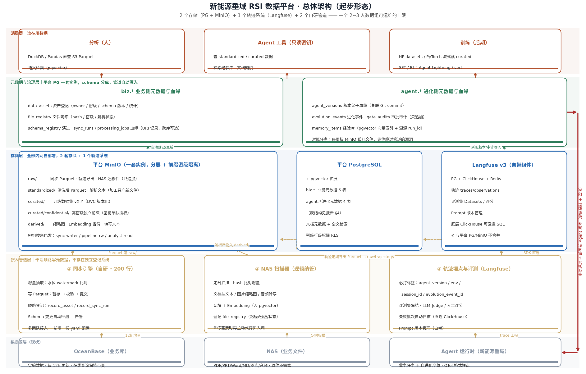
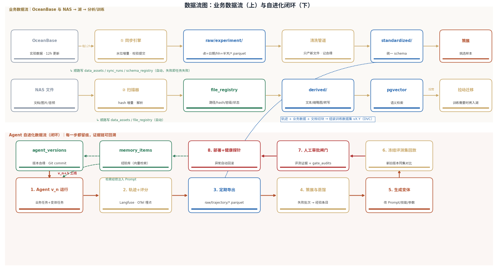

# 新能源垂域 RSI Agent 数据平台建设与选型方案

> 面向：研究院数据组 | 环境：内网自部署 | 规模：单业务团队约 50 人，数据量小起步、渐进扩展
> 版本：v1.0（2026-10-10）

---

## 1. 现状与目标

### 1.1 现状盘点

| 项 | 现状 | 主要缺口 |
|---|---|---|
| 业务团队 | 一个，约 50 人 | — |
| 结构化数据 | 实验数据存 OceanBase，每 12 小时业务更新，已有定时同步链路 | 无元数据、无血缘、无冻结快照 |
| 非结构化数据 | PDF / PPT / Word / MD / 图片 / 音频，存于业务 NAS | 开发团队未统一纳管，无解析、无检索、无密级管控 |
| Agent 侧平台 | 未开始搭建 | 自进化所需的轨迹、评测、记忆、版本、审计数据全部缺失 |

### 1.2 建设目标

为新能源垂域自进化（RSI）Agent 提供数据底座，支撑四类消费：

1. **分析**：业务人员与工程师对实验数据的 Python/SQL 分析；
2. **Agent 运行**：Agent 执行任务时查询业务数据、检索文档知识与经验；
3. **自进化闭环**：轨迹采集 → 评测 → 变体 → 审批 → 部署，全程留痕可回溯；
4. **模型训练（后期）**：产出版本化、可复现的训练数据集。

### 1.3 设计原则（贯穿全案）

- **按当前规模给药，留演进路径**：2 个存储（PostgreSQL + MinIO）+ 1 个轨迹系统（Langfuse）+ 2 个自研管道起步，是一个 2~3 人数据组可运维的上限；所有重型组件（Iceberg、DataHub、独立图库、Elasticsearch）都有明确的引入触发条件，不预先建设。
- **元数据不靠人填**：所有元数据与血缘由管道在干活的顺路自动写入，登记失败即任务失败。
- **只追加、不修改**：raw 层文件与审计表只增不改，一切加工产新文件，保证任意时点可回溯。
- **密级从第一天落地**：三级密级字段（public / internal / confidential）贯穿所有表与存储前缀。

---

## 2. 总体架构



架构分五层，自底向上：

| 层 | 组成 | 职责 |
|---|---|---|
| 数据源层 | OceanBase、NAS、Agent 运行时 | 保持现状，不动在线业务 |
| 接入管道层 | ① 同步引擎 ② NAS 扫描器 ③ Langfuse 埋点 | 抽取/解析/采集，**顺路写元数据** |
| 存储层 | 平台 MinIO（分层 bucket）、平台 PostgreSQL（+pgvector）、Langfuse 自带组件 | 文件型数据与元数据分别承载 |
| 元数据与治理层 | 平台 PG 内 biz.* 五表 + agent.* 四表 | 资产登记、血缘、版本、审计、密级 |
| 消费层 | 分析（人）、Agent 工具、训练框架 | DuckDB 直查、只读密钥访问、流式读训练集 |

关键结构性决策：

- **Langfuse 自带的 PG/MinIO 与平台 PG/MinIO 是两套，不合并**——组件内部存储与平台元数据分离，升级与故障互不影响。
- **NAS 不搬家**：第一阶段只做逻辑纳管（扫描登记 + 解析），原件留在 NAS；训练需要时拉动式拷贝入湖。
- **血缘用 URI 字符串记录**（`ob://…`、`s3://…`、`nas://…`），天然支持跨系统追溯，不依赖任何数据库的内部血缘功能。

---

## 3. 数据流



### 3.1 业务数据流（上半）

```
OceanBase ──每12h──> ① 同步引擎 ──> raw/experiment/dt=日期/hh=半天/*.parquet
                                        │ 顺路写 data_assets + sync_runs + schema_registry
                                        ▼
                          清洗管道 ──> standardized/ ──> 策展 ──> curated/训练数据集 vX.Y

NAS 文件 ──定时──> ② 扫描器 ──> file_registry 登记（hash/密级/解析状态）
                        │
                        ├─> 解析产物 → derived/（文本切块、缩略图、转写）
                        ├─> Embedding → pgvector（语义检索）
                        └─> 训练需要时拉动式拷贝 → raw/documents|images|audio/
```

### 3.2 Agent 自进化闭环（下半）

```
1. Agent v_n 运行（业务任务 + 变体任务，OTel 埋点，必打 agent_version/env/session_id/evolution_event_id）
2. 轨迹与评分入 Langfuse（traces / observations / scores）
3. 定期导出 Parquet → raw/trajectory/（分析、训练、长期归档三用）
4. 策展与蒸馏：失败批次自动扫描（直连 ClickHouse SQL）→ 经验条目入 memory_items
5. 生成变体（改 Prompt / 技能 / 参数）→ agent_versions 记父子血缘 + Git commit
6. 冻结评测集回放：新旧版本同一评测集对比，评分矩阵留存
7. 人工审批闸门：评测证据 + 审批记录入 gate_audits（只追加）
8. 部署 + 健康探针：异常自动回滚；经验库经向量检索注入新 Agent 的 Prompt
```

两条流在**策展环节汇合**：训练数据集 = 轨迹（自进化侧）+ 业务实验数据 + 文档切块（业务侧），统一 DVC 版本化。

---

## 4. 元数据与血缘设计（平台 PG）

一套 PostgreSQL 实例，按 schema 分库：`biz.*` 管业务侧，`agent.*` 管进化侧。

### 4.1 biz.* 五张表

| 表 | 管什么 | 谁写 | 写入时机 |
|---|---|---|---|
| `data_assets` | 资产登记：名称、类型、URI、owner、team、密级、schema 版本、统计（行数/最新数据时间） | 同步引擎/扫描器 | 首次 INSERT，之后每次 UPDATE 统计字段 |
| `file_registry` | NAS 文件明细：路径、hash、大小、密级、所属项目、解析状态、embedding 状态 | 扫描器 | 每次扫描后批量 upsert |
| `schema_registry` | 资产 schema 演进历史：版本、字段清单、变更点、变更时点 | 同步引擎 | 检测到 schema 变化时新增一版 |
| `sync_runs` | 同步血缘（只追加）：来源表、水位区间、产出文件、行数、checksum、状态 | 同步引擎 | 每次同步一条，**失败也记** |
| `processing_jobs` | 加工血缘（只追加）：输入 URI 数组、输出 URI 数组、脚本版本（git commit）、参数、状态 | 各加工管道 | 每个任务起止各写一次 |
| `dataset_versions` | 训练数据集版本：文件 hash 清单、DVC 版本、对应代码 commit、关联 agent_version | 策展脚本 | 每次发布数据集 |

（dataset_versions 属于 biz 与 agent 的交界，物理上放 biz schema 即可。）

### 4.2 agent.* 四张表

| 表 | 管什么 |
|---|---|
| `agent_versions` | 版本号、父子血缘（parent_version）、Git commit、Prompt 版本引用、评测分数摘要、部署状态 |
| `evolution_events` | 一次完整进化循环：event_id、变体内容、评测证据引用、选择理由、审批人、部署结果 |
| `gate_audits` | 审批审计（只追加）：谁、何时、批准/拒绝哪个版本、依据哪份评测证据、回滚记录 |
| `memory_items` | 经验条目：标题、适用条件、内容、embedding（pgvector）、source_run_id 溯源、有效期、密级 |

### 4.3 自动登记的实现

不存在独立的"元数据登记系统"。登记 = 管道代码里的公共函数调用：

```python
# metadata.py —— 所有管道共用的登记客户端（约 20 行核心）
def record_asset(conn, name, type, uri, owner, security_level, team, description="", schema=None):
    """INSERT ... ON CONFLICT (name, team) DO UPDATE —— 存在即更新统计字段"""

def record_sync_run(conn, asset_id, source_uri, output_uri, wm_start, wm_end,
                    row_count, checksum, status, error=None):
    """只追加；失败也写 status='failed' + 错误信息"""
```

三条必须立住的纪律：

1. **登记失败 = 任务失败**：宁可数据没进，不要数据进了没登记；
2. **命名规范前置**：资产命名 `团队_数据源_主题`，yaml 配置不合规拒绝运行；
3. **每周对账任务**：扫 MinIO 全量 key 与血缘表比对，列出"有文件无登记"的孤儿清单——兜住绕过管道的漏洞。

### 4.4 血缘：为什么自研、能跨库、可长期用

- **血缘 ⊂ 元数据**：data_assets/file_registry/schema_registry 回答"数据是什么"；sync_runs/processing_jobs 回答"从哪来到哪去"。后者必须是关系记录表（每条边一行、只追加），不能做成资产表的字段（一对多、多跳、要存历史）。
- **跨库追溯**：血缘记录的是 URI 字符串而非数据库内部 ID，一条递归 CTE 即可从 OceanBase 源表追到 Agent 版本和审批人，穿过多少个异构系统都无所谓。注意边界：追的是"血缘记录"，跨源联合取数分析是另一件事（联邦查询，现阶段不需要）。
- **长期使用成立**：触发切换平台级血缘工具（OpenMetadata/Marquez/院里大数据平台）的条件是协作复杂度信号——非 SQL 用户频繁查血缘、外部团队管道接入导致登记纪律失控、合规要求可视化证据——**不是资产数量**。PG 数万条血缘边的查询性能十年内都不是瓶颈。
- **与业界的接口**：字段设计对齐业界模型（asset↔Dataset、security_level↔Tag、sync_runs↔DataJob），将来要接 Gravitino/OpenMetadata 或院里大数据平台血缘，导出导入即可，无锁定。

---

## 5. 存储选型

### 5.1 文件型数据底座：MinIO（而非继续用 NAS 承载）

四类平台数据——**业务文件原件与解析产物、标准化 Parquet、版本化训练数据集、轨迹大 payload**——共性是"文件形态、程序读写"。选 MinIO 而非 NAS 的理由：

| 维度 | NAS | MinIO |
|---|---|---|
| 生态接口 | 需每节点挂载 NFS/SMB，容器环境麻烦 | **S3 API 是 AI 生态通用语言**：DuckDB/Pandas/PyTorch/HF datasets/DVC/Langfuse 原生直读 |
| 权限粒度 | 目录级，靠运维自觉 | 密钥 + Policy 按 bucket 前缀精细授权 |
| 并发写 | NFS 锁与一致性有坑 | 语义对数据管道友好 |
| 运维 | 现有 | 单容器 2C4G，半天部署 |

**NAS 继续保留**做人用的文件共享与原始来源地；平台数据走 MinIO。若短期不想再引入组件，Parquet 可暂放 NAS 专用目录过渡，但须满足：单一写入者 + 存储路径抽成配置；出现多机并发、精细授权、Langfuse 大 payload、训练框架接入任一信号即迁。

### 5.2 为什么 OceanBase 实验数据要转 Parquet 落湖

不是替代 OceanBase（在线查询保持不变），而是补四项它给不了的能力：

1. **负载隔离**：分析/训练是全量扫描型负载，直接打 OceanBase 会与在线业务争资源；读文件副本零影响；
2. **生态接口**：Python/训练框架直读 S3 Parquet 是一行配置，免去每个使用者各自申请账号、写连接代码；
3. **冻结快照**：自进化的评测证据链要求"agent_v5 和 v6 在同一份数据上对比"——活数据库回答不了"当时是什么"，不可变 Parquet 文件天然是时点快照；
4. **成本归档**：Parquet 压缩 5~10 倍，历史数据从高性能库转移到廉价对象存储。

同步方式：**12 小时增量**（水位字段比对），按 `dt=/hh=` 分区只追加新文件，"全量视图"由查询时拼出；写文件走"暂存→校验→提交"，血缘记录最后写。

### 5.3 向量检索：pgvector

平台 PG 加载 pgvector 扩展即可承载：文档切块 embedding、经验条目检索。理由：百万级以下向量量无需独立组件；文档与向量同事务更新；密级过滤就是一条 WHERE；零新增运维。升级触发条件：向量 >50M、P95 延迟不达标、或需要复杂多模态混合检索 → 迁 Qdrant（数据可从原始文件重建，非迁移式替换）。

### 5.4 时序数据：按需引入 TDengine

若后续接入功率曲线/气象/设备遥测类时序数据：**TDengine 在线 + 冷数据归档 Parquet 入湖**。在 TSBS IoT 基准中其摄入与压缩显著优于通用库（厂商报告值，需 POC 验证）。若团队 PG 经验优先且数据量中等，可用 TimescaleDB 过渡。当前无此类数据源则不建。

### 5.5 不建什么（同样重要）

| 不建 | 原因 | 触发再评估的条件 |
|---|---|---|
| 独立图数据库（Neo4j 等） | 设备拓扑初期 PG 递归查询即可 | 需要 GraphRAG 或多跳故障分析 |
| Elasticsearch/MongoDB | 文档元数据+全文检索 PG（tsvector）足够 | 文档量超千万级或需复杂聚合分析 |
| Iceberg + REST Catalog | 单写入者无并发写/Time Travel 刚需 | 多任务并发写湖、实验快照强需求 → 连带上 Gravitino |
| DataHub/OpenMetadata | 资产数十个，SQL 查比搜索框快 | 资产 >300~500 且多团队、非 SQL 用户有查询需求 |
| 大数据平台血缘 | 自研血缘满足且结构兼容 | 协作复杂度信号（见 §4.4） |

---

## 6. Agent 侧：自进化需要的数据与 Langfuse 决策

### 6.1 七种数据及存储

| # | 数据 | 存哪 | 管理要点 |
|---|---|---|---|
| 1 | 轨迹（thought/工具调用/LLM 请求响应/token/延迟/错误） | Langfuse（ClickHouse）+ 定期导出 Parquet 入湖 | OTel GenAI 格式；四个必打标签 |
| 2 | 评测数据（冻结评测集、评分明细） | Langfuse Datasets/Scores + 大附件在 MinIO | 评测集只增不改；分数关联 agent_version + dataset_version |
| 3 | 经验/记忆 | 平台 PG `memory_items` + pgvector | 溯源 source_run_id、有效期、密级 |
| 4 | Agent 版本档案 | Git（代码/Prompt）+ `agent_versions` 表 | 每次变更 = commit + 版本记录 + 评测证据引用 |
| 5 | 进化事件 | `evolution_events` 表 | event_id 打进轨迹 metadata，串起全链 |
| 6 | 审批与审计 | `gate_audits` 表 | 只追加，保留期独立设定 |
| 7 | 训练数据集 | MinIO curated/ + DVC | 数据集版本 ↔ Git commit ↔ agent_version 三方对齐 |

**核心认知：2~6 全是 PG 表设计问题，Agent 侧真正需要选型的组件只有轨迹系统一个。**

### 6.2 轨迹系统选型：Langfuse vs 自研

| 路线 | 优势 | 代价 | 结论 |
|---|---|---|---|
| **Langfuse v3（推荐）** | 追踪+评测集+评分+Prompt 管理开箱即用；MIT；自部署 compose 一体拉起；底层 ClickHouse 可直连 SQL | 约 2C4G 资源；内网需离线导入镜像 | 自进化瓶颈在"评测与对比工作流"而非存轨迹，自研这套要 1~2 人月且更差 |
| 最小自研（PG runs/steps 两表） | 零新增组件 | 无 UI、无评测工作流、成本核算自写；量上来还得换 | 仅作 Langfuse 落地失败的退路；埋点同为 OTel 格式，切换不改业务代码 |

---

## 7. 安全与权限

| 层面 | 现在做 | 后期加 |
|---|---|---|
| 网络 | 全内网部署；API Key/密钥进 K8s Secret 或配置中心，不进代码库 | 服务间 mTLS |
| 身份 | 人走 SSO（LDAP/AD）三类角色：只读分析/数据工程师/管理员；进程用服务账号最小权限（采集只能写、回放只能读） | 项目级细粒度 |
| 密级 | 三级字段贯穿 data_assets/file_registry/memory_items；**PG 行级安全 RLS 强制过滤**；MinIO 按密级分前缀、密钥按角色发放（低权限物理上看不见高密级文件）；**embedding 继承原文档密级**，向量检索必带密级 WHERE | 组件增多后引 OPA 统一策略引擎 |
| 脱敏 | 采集层 PII 过滤（正则+词典），Langfuse mask 钩子；原文入 confidential 前缀、脱敏版入 standardized，单向流动；LLM-Judge 优先内网本地模型 | 自动脱敏模型 |
| 审计 | gate_audits + data_lineage（evolution_event_id / data_snapshot_id 贯穿）；MinIO 开访问日志，confidential 前缀异常访问告警 | 合规报表自动生成 |
| 运行时 | 评测/回放沙箱容器（限网限资源）；工具调用白名单；评估器与变体隔离（防 objective hacking） | 注入攻击红队测试 |

MinIO 侧密钥清单：sync-writer（只写 raw/）、pipeline-rw（读 raw 写 standardized）、curator（读 standardized 写 curated）、analyst-read（人，只读）、agent-read（Agent，只读）、conf-read（高密级，单独申请）。人与进程分开、写权限按层单向流动。

---

## 8. 分阶段落地路线

| 阶段 | 周期 | 做什么 | 验收标准 |
|---|---|---|---|
| **P0 底座** | 2~3 周 | PG（+pgvector）+ MinIO 部署；建 biz.*/agent.* 表；同步引擎 v1（OceanBase 增量→Parquet→登记血缘） | DuckDB 能查实验数据；每条数据可溯源到 OceanBase 源表 |
| **P1 业务纳管** | 3~4 周 | NAS 扫描器 + file_registry；文档解析+embedding 入库；密级字段上线；每周对账任务 | 任意文件可查元数据与解析状态；语义检索 demo；孤儿文件周报 |
| **P2 Agent 平台** | 3~4 周 | Langfuse 部署（prod/dev 双项目、Key 分开）；Agent 埋点接入；metadata/tag 规范成文；冻结首版评测集 | 每次任务有完整 trace，可按版本/env 过滤对比 |
| **P3 进化闭环** | 1~2 月 | agent_versions/evolution_events/gate_audits 上线；轨迹定期导出 Parquet 入湖；失败批次自动策展；审批流+回滚探针 | 跑一次完整"变体→评测→审批→部署→血缘可查"循环 |
| **P4 训练就绪** | 按需 | 训练数据集策展管道；DVC 版本化；NAS 拉动式迁移；（需要权重级进化时）Agent Lightning 接入 | 产出一个版本化、可复现的训练数据集 |

多团队扩展路径：同步引擎已配置化（新团队 = 一份 yaml + 人工审密级/owner）；第二团队接入前，专门评审一次 data_assets/sync_runs 表结构（加 team 字段等），此后改 schema 就是迁移工程。

---

## 9. 关键决策速查（FAQ）

- **为什么业务数据要出 OceanBase？** 负载隔离、生态接口、冻结快照、归档成本四项能力；在线查询不受影响。详见 §5.2。
- **为什么 MinIO 而不是继续用 NAS？** NAS 是人用的共享文件夹，MinIO 是程序用的数据底座（S3 API + 密钥级权限 + 管道友好并发）。NAS 保留其本职。详见 §5.1。
- **为什么元数据用两张表而不是成熟产品？** 当前规模下产品的增量功能（搜索、自动采集、工作流）用不出价值，运维成本却翻倍；且 AI 血缘（版本/进化/审批）任何产品都管不了，总要自研。字段对齐业界模型，迁移无锁定。详见 §4.4。
- **血缘能跨 OceanBase/MinIO/NAS/Langfuse 追吗？** 能——记录 URI 字符串而非内部 ID，递归 SQL 一跳一句。前提是每段管道都登记，对账任务兜底。详见 §4.4。
- **每次业务数据更新都要维护元数据吗？** 不用。99% 的更新只自动改统计字段；只有 schema 变更（自动检测+人工确认）、口径变化（靠业务通知+手工标注）、新资产（自动登记+人工审密级）三种情况需要人介入，每次约 10 分钟。
- **训练模型需要实验结构化数据吗？** 训练 LLM/Agent 不直接需要（轨迹才是训练主体，实验数据作为环境和评测依据间接参与）；若做领域专业模型（寿命预测、故障诊断等），实验数据就是核心训练输入，清洗标准化优先级提到最高。建议团队先对齐 RSI Agent 的进化目标定位。

---

## 10. 演进触发条件总表

| 信号 | 动作 |
|---|---|
| 向量 >50M / 检索延迟不达标 / 多模态混合检索需求 | pgvector → Qdrant |
| 接入功率/气象/设备遥测 | 引入 TDengine（+ 冷数据归档入湖） |
| GraphRAG / 多跳故障分析需求 | 引入 Neo4j（十亿边级或国产自主可控要求则 NebulaGraph） |
| 多任务并发写湖 / 强 Time Travel 需求 | Parquet → Iceberg，配 Gravitino 作 REST Catalog |
| 资产 >300~500 + 多团队 + 非 SQL 用户查询需求 | catalog.db → OpenMetadata |
| 非 SQL 用户查血缘 / 登记纪律失控 / 合规可视化要求 | 接 Marquez 或院里大数据平台血缘（先确认其组件、写权限、粒度三条件） |
| 权重级进化（SFT/RL）立项 | Agent Lightning（轨迹 OTel 格式与现有埋点天然兼容）→ 大规模时 verl/OpenRLHF |
| 密级策略跨组件维护不一致 | 引入 OPA 统一策略引擎 |

---

*本方案所有性能类引用数据均为厂商自报值，选型落地前须以自有数据做 POC 验证；Langfuse 等开源组件迭代快，部署细节以实施时官方文档为准。*
